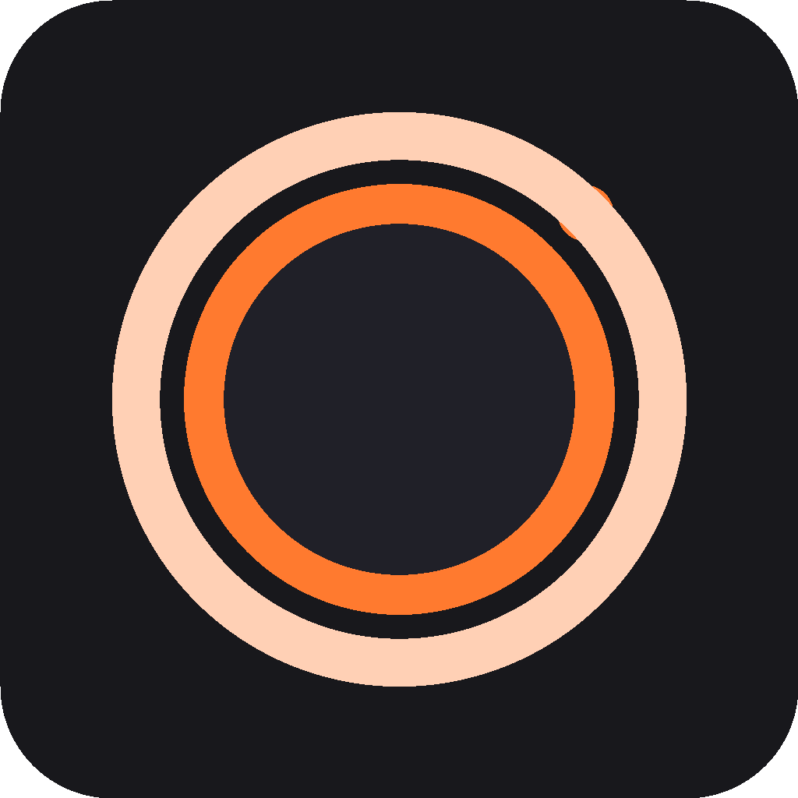
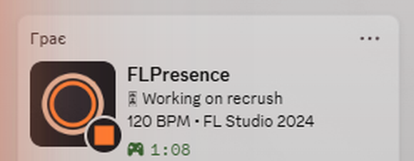
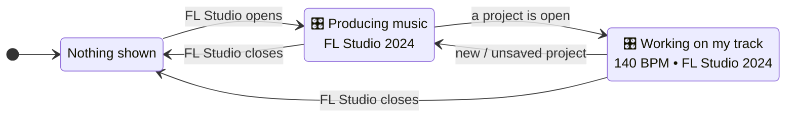
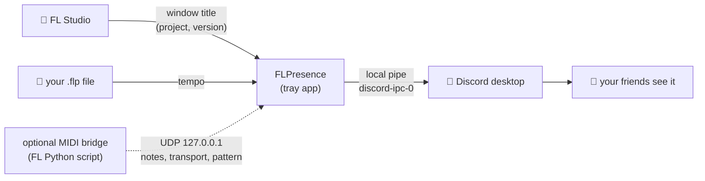
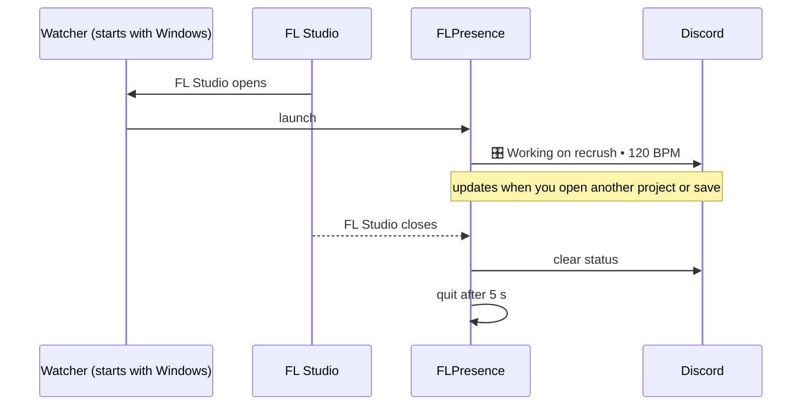

<p align="center">
  
</p>

<h1 align="center">FLPresence</h1>

<p align="center">
  <b>Discord Rich Presence for FL Studio.</b><br>
  Your friends see what you're producing: the project, the BPM and how long you've been at it.
</p>

<p align="center">
  <a href="../../releases/latest"></a>
  
  
  
</p>

<p align="center">
  
  <br><sub>A real Discord profile while FL Studio is open. The Discord UI here is in Ukrainian ("Грає" means "Playing").</sub>
</p>

---

## Why?

Discord shows when you're playing a game or listening to Spotify. When you're making music in FL Studio, you just look **idle**.
FLPresence fixes that. You open a project and your profile says so, with no clicks, config or accounts involved.

- 🎧 **Show your friends you're working.** Collaborators know you're in the studio, and they know which track you're on.
- ⏱ **See your own sessions.** The timer counts how long FL Studio has been open.
- 🔒 **Stay private when you need to.** Secret Mode hides project names in one click.

## Install (about a minute)

1. Download **[`FLPresence.exe`](../../releases/latest)** from Releases.
2. Run it **once**. You'll see *"FLPresence is installed"*.
3. That's it. Open FL Studio and your Discord status appears. Close FL Studio and it's gone.

> **Windows SmartScreen** may say *"unknown publisher"* because the exe isn't code-signed.
> Click **More info → Run anyway**. The full source code is in this repo, and the exe is built by
> [GitHub Actions](.github/workflows/release.yml) from that exact code.

No admin rights, no .NET install, no setup wizard. It installs per-user to `%LOCALAPPDATA%\Programs\FLPresence`.
If your system drive is full, it uses the drive you ran it from instead.

**Uninstall:** *Settings → Apps → Installed apps → FLPresence → Uninstall.*

## What you get

| | Feature | Notes |
|---|---|---|
| 🎛 | **Project name** | `Working on <your project>`. Unsaved new projects show `Producing music`. |
| 🥁 | **BPM** | Read from the saved `.flp` file. It updates each time you press **Ctrl+S**. |
| 🏷 | **FL Studio version** | `FL Studio 2024`, `FL Studio 21`, and so on. |
| ⏱ | **Session timer** | Counts from the moment FL Studio started. |
| 🚀 | **Starts with FL Studio** | It launches when FL opens and quits a few seconds after FL closes. Nothing sits in your tray while you're not producing. |
| 🎹 | **No MIDI keyboard required** | Works on any machine out of the box. |
| 🕵️ | **Secret Mode & privacy** | Tray icon → *Settings*: hide the project name, the BPM or the timer. Also choose your producer name and custom text templates. |
| 🧩 | **Optional live mode** | With a physical MIDI controller you also get live notes and chords (`🎹 C#m7`), ▶ play / ⏺ record, the pattern, the channel and the plugin. See below. |

### What it shows, and when



## How it works



- **Nothing leaves your PC** except the status text itself, which Discord shows to your friends.
  There are no servers, accounts, bots, tokens or telemetry.
- **FL Studio is never modified.** FLPresence reads FL's window title and your saved project file.
  It does not read FL's memory and doesn't inject into it.
- **Lifecycle:** a tiny background watcher (no window, next to zero CPU) starts the app when FL Studio opens.
  The app quits about 5 seconds after FL Studio closes.



## Compatibility

| | Supported |
|---|---|
| **FL Studio** | 20, 21, 24 / 2024 (64- and 32-bit). Tested on **FL Studio 2024 (24.2)**. Any edition: Fruity, Producer, Signature, All Plugins. |
| **Windows** | 10 and 11, x64 |
| **Discord** | Desktop app (stable, PTB, Canary). The browser version can't receive Rich Presence. |
| **MIDI keyboard** | Not required. Optional for live mode. |

## What it does NOT do (honest limitations)

- ❌ **Live notes, play/record state, pattern and plugin need a MIDI controller.** FL Studio only exposes those
  to a *controller script*, and FL only loads controller scripts for physical MIDI devices.
  Without one you still get the project, BPM, version and timer.
- ❌ **BPM comes from the saved file.** If you change the tempo, it shows after **Ctrl+S**.
- ❌ **Windows only.** There's no macOS version yet.
- ❌ **"Activity privacy" in Discord must be on.** *Discord → Settings → Activity Privacy →
  Share your detected activities with others*.
- ⚠️ **The exe isn't code-signed**, so you'll see the one-time SmartScreen prompt described above.

## Optional: live mode with a MIDI keyboard

If you have a **physical** MIDI controller (MPK, Launchkey, and so on):

1. Open FL Studio → **Options → MIDI Settings**.
2. Select your device under **Input** and enable it.
3. Set **Controller type** to **FLPresence** (the app puts the script there automatically).
4. Restart FL Studio.

Discord then also shows what you play, live:

```
🎹 C#m7
Serum • 140 BPM • Live MIDI
```

> FL Studio allows **one controller script per MIDI input**. If your keyboard already uses another script
> (Mackie, Akai, Novation), choose which one you want.

## FAQ

<details>
<summary><b>My status doesn't show up in Discord</b></summary>

- Use the Discord **desktop app**, not the browser version.
- Turn on *Settings → Activity Privacy → Share your detected activities with others*.
- Open a project in FL Studio. The status should appear within a few seconds.
- The log is at `%LOCALAPPDATA%\FLPresence\logs\flpresence.log`.
</details>

<details>
<summary><b>How do I hide the project name?</b></summary>

Right-click the tray icon (while FL Studio is open) → **Secret Mode**, or go to **Open Settings** for fine-grained options.
</details>

<details>
<summary><b>I reinstalled Windows. How do I get it back?</b></summary>

Download `FLPresence.exe` from [Releases](../../releases/latest) and run it once. Settings live in `%APPDATA%\FLPresence`.
</details>

<details>
<summary><b>Is it safe? Could it be seen as a cheat or break FL Studio?</b></summary>

It only reads FL Studio's window title and your saved `.flp`, and talks to Discord through Discord's own official local pipe.
There's no memory reading and no DLL injection, and nothing leaves your computer.
</details>

## For developers

Requires the [.NET 8 SDK](https://dotnet.microsoft.com/download/dotnet/8.0).

```powershell
dotnet test tests/FLPresence.Tests                                 # unit tests
powershell -ExecutionPolicy Bypass -File installer\install.ps1     # build + install locally
```

Releases: push a tag (`git tag v1.4.0 && git push --tags`). GitHub Actions runs the tests and attaches `FLPresence.exe` to the release.

More detail: [ARCHITECTURE.md](ARCHITECTURE.md) · [LIMITATIONS.md](LIMITATIONS.md) · [CHANGELOG.md](CHANGELOG.md)

## License

[MIT](LICENSE). Free to use, modify and share.
FL Studio is a trademark of Image-Line. This project is not affiliated with Image-Line or Discord.
